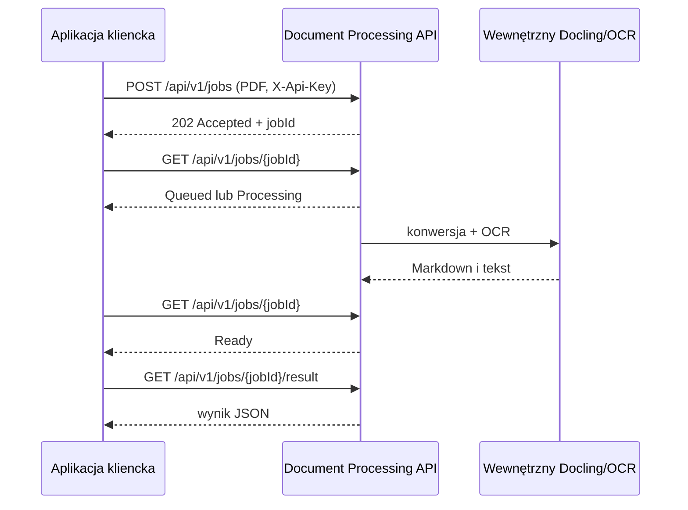

# Integracja z kontenerami OCR z innej aplikacji

Ten dokument opisuje publiczny kontrakt usługi przetwarzania dokumentów uruchomionej z Doclingiem. Jest to właściwy punkt integracji dla innych aplikacji. Nie odpytywać bezpośrednio kontenera `docling`: jest on usługą wewnętrzną sieci Docker, a API pośredniczące dodaje autoryzację, limity, kolejkę, walidację PDF i jednolity format wyniku.

W bieżącym wdrożeniu usługa przyjmuje **wyłącznie pliki PDF**. Docling wyodrębnia z nich tekst i strukturę do Markdown oraz zwykłego tekstu; dla stron skanowanych używa OCR. Nie jest to endpoint do przesyłania pojedynczych obrazów PNG/JPEG.

## Adres i uwierzytelnianie

Na serwerze produkcyjnym bazowy adres API to:

```text
http://192.168.21.14:5080
```

Każde wywołanie pod `/api/v1/jobs` wymaga nagłówka:

```http
X-Api-Key: <DOCUMENT_PROCESSING_API_KEY>
```

Wartość `DOCUMENT_PROCESSING_API_KEY` jest sekretem wdrożeniowym przechowywanym w `deploy/document-processing/.env` na serwerze. Pobierz ją z zatwierdzonego magazynu sekretów lub od administratora; nie wpisuj jej do kodu, pliku `.env` śledzonego przez Git, logów ani zrzutów błędów. Endpoint `GET /health` nie wymaga klucza.

W aplikacji klienckiej konfiguruj adres i klucz przez zmienne środowiskowe, przykładowo:

```bash
export OCR_API_URL='http://192.168.21.14:5080'
export OCR_API_KEY='wartosc-pobrana-z-magazynu-sekretow'
```

Port `5080` powinien pozostawać dostępny wyłącznie z zaufanej sieci prywatnej. Jeżeli aplikacja kliencka działa poza nią, należy najpierw uzgodnić bezpieczny reverse proxy/VPN i reguły firewalla — nie należy wystawiać tego portu bezpośrednio do Internetu.

## Przepływ asynchroniczny

Przetwarzanie jest asynchroniczne. Aplikacja przesyła PDF, dostaje identyfikator zadania, cyklicznie sprawdza jego status, a po stanie `Ready` pobiera wynik.



Odpytywanie statusu co 1–2 sekundy jest wystarczające. Po błędzie tymczasowym sieci wykonaj ograniczoną liczbę ponowień z wykładniczym opóźnieniem. Nie wysyłaj automatycznie tego samego PDF ponownie tylko dlatego, że odpytywanie statusu chwilowo nie powiodło się — najpierw spróbuj odczytać status istniejącego `jobId`.

## Endpointy

| Metoda i ścieżka | Cel | Odpowiedź powodzenia |
| --- | --- | --- |
| `GET /health` | Kontrola dostępności kontenera API | `200 {"status":"healthy"}` |
| `POST /api/v1/jobs` | Dodaje PDF do kolejki OCR/konwersji | `202 Accepted` |
| `GET /api/v1/jobs/{jobId}` | Odczytuje stan zadania | `200 OK` |
| `GET /api/v1/jobs/{jobId}/result` | Pobiera gotowy wynik | `200 OK` |
| `DELETE /api/v1/jobs/{jobId}` | Anuluje/usunie zadanie i jego wynik | `204 No Content` |

### 1. Wysłanie dokumentu

Wyślij `multipart/form-data`, z polem formularza o nazwie **`file`**. Plik musi mieć rozszerzenie `.pdf` oraz typ MIME `application/pdf`.

```bash
curl --fail-with-body --silent --show-error \
  --request POST "$OCR_API_URL/api/v1/jobs" \
  --header "X-Api-Key: $OCR_API_KEY" \
  --form 'file=@./faktura.pdf;type=application/pdf'
```

Przykładowa odpowiedź `202`:

```json
{
  "jobId": "3d7cef3b8aec4af1bc9b4e348c0d5a90",
  "status": 0,
  "acceptedAt": "2026-07-25T10:15:30.1234567+00:00"
}
```

Zachowaj `jobId` w swojej aplikacji. Aktualnie wartości stanu są liczbami:

| Wartość | Nazwa | Znaczenie |
| --- | --- | --- |
| `0` | `Queued` | Zadanie oczekuje w kolejce. |
| `1` | `Processing` | Docling przetwarza dokument. |
| `2` | `Ready` | Wynik jest dostępny do pobrania. |
| `3` | `Failed` | Przetwarzanie zakończyło się błędem. |

### 2. Sprawdzenie statusu

```bash
job_id='3d7cef3b8aec4af1bc9b4e348c0d5a90'
curl --fail-with-body --silent --show-error \
  --header "X-Api-Key: $OCR_API_KEY" \
  "$OCR_API_URL/api/v1/jobs/$job_id" | jq
```

Przykład w trakcie pracy:

```json
{
  "jobId": "3d7cef3b8aec4af1bc9b4e348c0d5a90",
  "status": 1,
  "progress": 10,
  "pageCount": 2,
  "provider": null,
  "errorCode": null
}
```

Gdy `status` ma wartość `2`, pobierz wynik. Gdy ma wartość `3`, obsłuż `errorCode`, zapisz go w telemetrii i pokaż użytkownikowi bezpieczny komunikat. `404` oznacza nieznany lub już usunięty identyfikator zadania.

### 3. Pobranie wyniku

```bash
curl --fail-with-body --silent --show-error \
  --header "X-Api-Key: $OCR_API_KEY" \
  "$OCR_API_URL/api/v1/jobs/$job_id/result" | jq
```

Przykładowa odpowiedź `200`:

```json
{
  "markdown": "# Faktura\n\nNumer: FV/42/2026",
  "plainText": "Faktura\nNumer: FV/42/2026",
  "pageCount": 2,
  "ocrUsed": true,
  "provider": "docling",
  "qualityScore": 1,
  "warnings": []
}
```

`markdown` jest najlepszym wyborem, gdy odbiorca zachowuje nagłówki, tabele i strukturę dokumentu. `plainText` wybierz do prostego indeksowania tekstowego. `ocrUsed` informuje, czy w konwersji użyto OCR. `warnings` należy zachować w logach/telemetrii integracji, ponieważ może sygnalizować częściowe ograniczenia ekstrakcji.

Wywołanie wyniku przed gotowością zwraca `409` z kodem `RESULT_NOT_READY`; po nieudanym przetwarzaniu zwraca `422`. Nie traktuj tych kodów jako wyniku dokumentu.

### 4. Usunięcie zadania

Po trwałym zapisaniu potrzebnego wyniku usuń zadanie, aby zwolnić pamięć procesu:

```bash
curl --fail-with-body --silent --show-error \
  --request DELETE \
  --header "X-Api-Key: $OCR_API_KEY" \
  "$OCR_API_URL/api/v1/jobs/$job_id"
```

## Kompletny przykład w Pythonie

Poniższy przykład wymaga pakietu `requests` i zwraca wynik jako słownik Python. Klucz pobiera wyłącznie ze zmiennej środowiskowej.

```python
import os
import time

import requests


base_url = os.environ["OCR_API_URL"].rstrip("/")
headers = {"X-Api-Key": os.environ["OCR_API_KEY"]}

with open("faktura.pdf", "rb") as pdf:
    response = requests.post(
        f"{base_url}/api/v1/jobs",
        headers=headers,
        files={"file": ("faktura.pdf", pdf, "application/pdf")},
        timeout=60,
    )
response.raise_for_status()
job_id = response.json()["jobId"]

deadline = time.monotonic() + 330
while time.monotonic() < deadline:
    response = requests.get(
        f"{base_url}/api/v1/jobs/{job_id}", headers=headers, timeout=15
    )
    response.raise_for_status()
    status = response.json()

    if status["status"] == 2:  # Ready
        result = requests.get(
            f"{base_url}/api/v1/jobs/{job_id}/result", headers=headers, timeout=30
        )
        result.raise_for_status()
        document = result.json()
        break

    if status["status"] == 3:  # Failed
        raise RuntimeError(f"OCR failed: {status['errorCode']}")

    time.sleep(1.5)
else:
    raise TimeoutError(f"OCR job {job_id} did not finish in time")

print(document["markdown"])
```

W aplikacji produkcyjnej dodaj własny identyfikator korelacji i mapowanie `jobId` do rekordu użytkownika. Nie loguj treści PDF, tekstu wynikowego ani nagłówka `X-Api-Key`, jeśli dokumenty mogą zawierać dane osobowe lub poufne.

## Limity, błędy i odporność integracji

Bieżąca konfiguracja produkcyjna CPU ma następujące limity: plik do 25 MiB, do 100 stron PDF, kolejka do 20 zadań i limit przetwarzania pojedynczego zadania 300 sekund. Równolegle wykonywane są najwyżej dwa zadania. Limity mogą zostać zmienione przy wdrożeniu, dlatego aplikacja powinna reagować na odpowiedzi API, a nie zakładać ich na sztywno.

| Sytuacja | HTTP | Kod / sposób obsługi |
| --- | --- | --- |
| Brak lub błędny klucz | `401` | Zweryfikuj konfigurację sekretu; nie ponawiaj bez końca. |
| Nieprawidłowe dane wejściowe | `400` | Np. `INVALID_CONTENT_TYPE`, `FILE_REQUIRED`, `UNSUPPORTED_FILE_TYPE`, `INVALID_PDF`, `FILE_TOO_LARGE`, `PAGE_LIMIT_EXCEEDED`. Popraw dokument. |
| Kolejka pełna | `429` | `QUEUE_FULL`; ponów później z rosnącym opóźnieniem. |
| Nieznane zadanie | `404` | Nie próbuj odtwarzać wyniku; rozpocznij nowy proces tylko, jeśli polityka biznesowa na to pozwala. |
| Wynik jeszcze niedostępny | `409` | `RESULT_NOT_READY`; wróć do odpytywania statusu. |
| Błąd konwersji | `422` | Odczytaj `errorCode` ze statusu, np. `DOCLING_CONVERSION_FAILED`, `PROCESSING_TIMEOUT` albo `PROCESSING_FAILED`. |

Stan zadań i wyników jest obecnie przechowywany w pamięci kontenera API. Restart tego kontenera powoduje utratę aktywnych oraz zakończonych zadań, więc integracja powinna przechowywać oryginalny PDF i umieć świadomie przesłać go ponownie po `404` lub po awarii infrastruktury. Nie zakładaj, że adres wyniku jest trwałym archiwum.

## CPU i GPU

Publiczny kontrakt HTTP jest taki sam dla wdrożenia CPU i GPU. Na obecnym serwerze standardowo działa wariant CPU. Wariant GPU jest przeznaczony dla okna wsadowego, gdy co najmniej 6 GiB VRAM jest wolne; nie należy uruchamiać go jednocześnie z dużym modelem Ollama zajmującym większość pamięci GPU. Szczegóły operacyjne i procedury uruchomienia znajdują się w [instrukcji wdrożenia](../deploy/document-processing/README.md).
